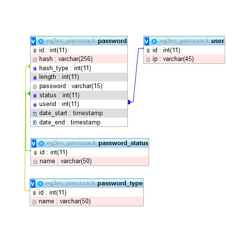

# PassCrack

PassCrack est une application gratuite et respectueuse de la vie privée qui a pour but de tester la complexité de vos mots de passe en tentant de les craquer.

[passcrack.ch](https://passcrack.ch)

## Schema de la base de donnée

## Crédits

[Bootstrap](https://getbootstrap.com/)

[jQuery](https://jquery.com/)

[Silicon](https://themes.getbootstrap.com/product/silicon-business-technology-template-ui-kit/)